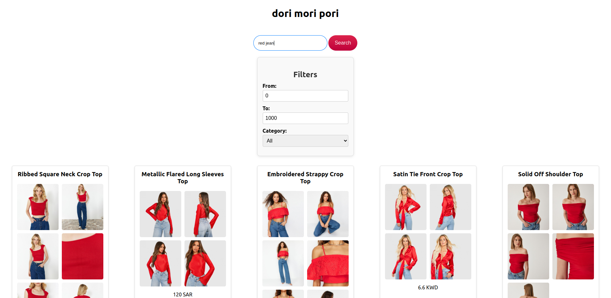

## Dori Mori Pori
This project is an interview task related to vector search for the [Dori](https://dori.style/) interview.
### Description
The objective of this project is to develop an application that encodes data and saves it to a vector database (such as Qdrant). The backend system receives queries from users, encodes them, and finds similar items in the database. Additionally, a frontend page is provided to display the images. The project also includes a data pipeline for processing the data in batches.
The dataset used in this project is located in the `products.json` file.
You can see full description [here](https://docs.google.com/document/d/e/2PACX-1vQhiohsEE3YE8pOEMKZyyWHpsrmH1WBXbnRkEGb5GQqQ_Rb3m5xO_ya-ODoIQ1j1pRxW5QYSf09eAwN/pub).
### Approach
I implemented a job for the data pipeline that reads the JSON dataset and inserts it into the database chunk by chunk. Each batch's progress is saved as a checkpoint in a checkpoint.txt file, allowing the service to continue and resume work after any failure. This process operates within containers for the API, database, and frontend services.
The technologies used include Qdrant, Pydantic, FastAPI, and CLIP models.

### Install
**backend**: <br > To set up the backend part of the application, run the following commands:


```bash
cd backend
docker compose up --build
docker compose up -d
```
If you want to run it locally with Python or wish to change configurations, create a `.env` file:
```bash
cp .env.example .env
```
Then modify the configurations as needed.

**frontend**: <br>
To set up the frontend part of the application, run:

```bash
cd frontend
docker compose up --build
docker compose up -d
```

### Run
After building your containers, you can use the services as follows: <br />
Access the backend API swagger at `http://localhost:8080/docs`. <br />
Access the qdrant dashboard `http://localhost:6333`. <br />
Access the frontend interface at `http://localhost:3000` (or whatever port is specified). <br />

